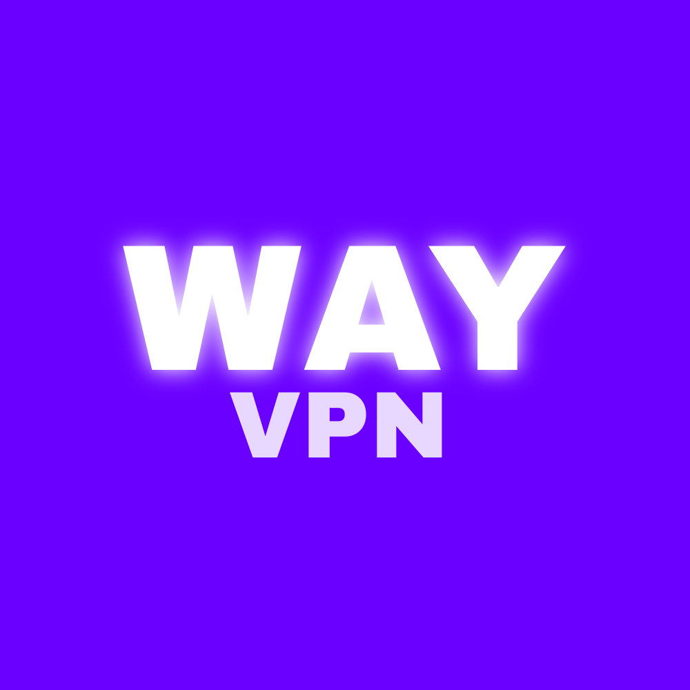

# Лучший бесплатный  клиент VPN — WayVPN

*В репозитории отключены официальные сервера WayVPN. Вы можете подключить свой сервер самостоятельно или скачать приложение на сайте (смотрите контакты). Обратитесь в поддержку для консультации.*
## Функции

~~1. Killswitch — при отключении WayVPN, отключится и сеть, что бы не допустить утечку реального IP.~~

~~2. Автовключение WayVPN — при входе в указанные приложения WayVPN будет автоматически подключаться к самому быстрому серверу.~~

~~3. Split Tunneling — установить какие приложения будут идти через WayVPN, а какие в обход.~~

4. Защита от DNS утечек — использование DNS WayVPN, что бы DNS-запросы не утекали вашему провайдеру.

~~5. WayVPN виджет — виджет на главном экране для быстрого подключения.~~

~~6. Расписание включения — WayVPN будет автоматически включаться по указанному расписанию.~~

~~7. Блокировщик рекламы — WayVPN будет автоматически блокировать всю рекламу, в приложениях и на вебсайтах.~~

8. Шифрование — WayVPN использует протокол VLESS обеспечивающий полную конфиденциальность перед провайдером.

# Официальные сервера WayVPN

1. Нидерланды - средний пинг 80 

*Для покупки новых серверов нужна ваша [поддержка](https://www.donationalerts.com/r/lastfirecompany), все кто поддержит нас хотя бы на 1 рубль будет указан на [сайте](https://www.way.lastfire.ru)*
# Контакты 

1. Сайт — [way.lastfire.ru](https://www.way.lastfire.ru)
2. Телеграм — [@WayWayVPN](https://t.me/@WayWayVPN)
3. Телеграм релизы — [@WayWayDownload](https://t.me/@WayWayDownload)
4. Поддержка — [@WayWaySupport](https://t.me/@WayWaySupport)
5. Донаты — [donationalerts](https://www.donationalerts.com/r/lastfirecompany)
